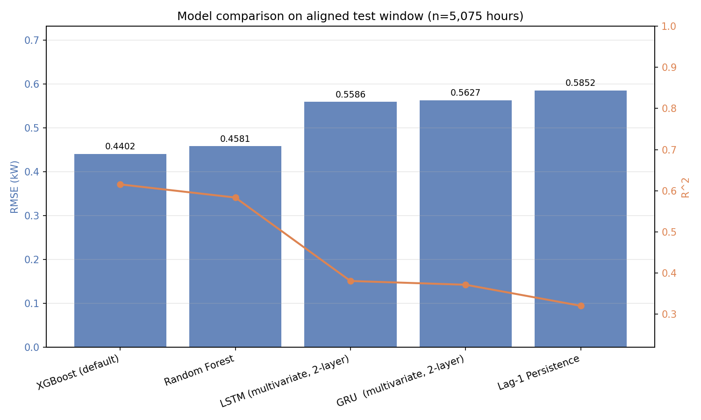
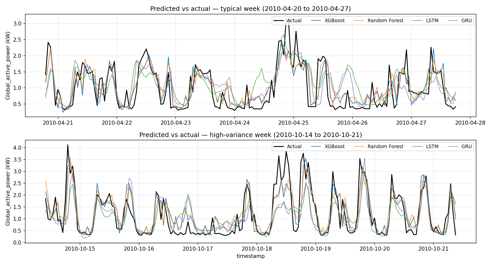
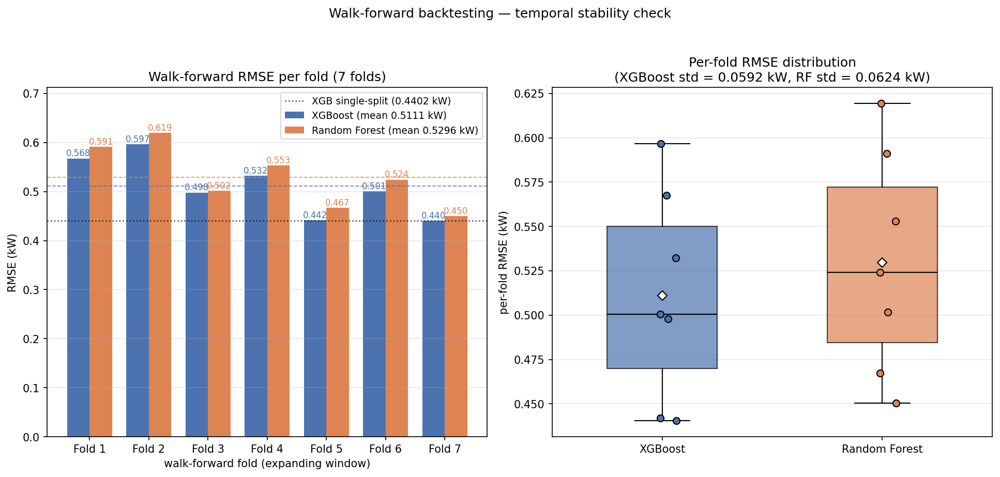
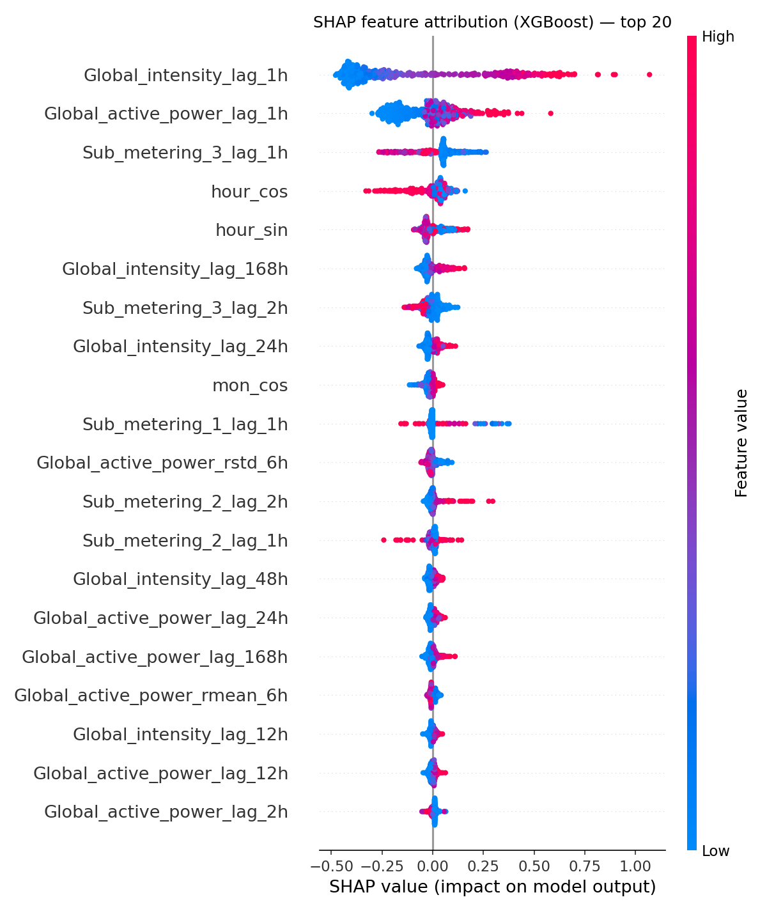

# Development of a Machine Learning Model for Predicting Energy Consumption in Smart Homes

**One-hour-ahead forecasting of household electric power consumption (kW), with an
interpretability study, weather-covariate and stacking extensions, and a deployed
REST inference service.**

<p align="left">
  
  
  
  
</p>

Bachelor thesis project, Astana IT University (AITU), programme 6B0611 *Computer Science*, June 2026.
Authors: **Yerassyl Raimkhan**, **Nurlan Mussepov**, **Amanzhan Gaisiev**.

---

## Abstract

Short-term load forecasting (STLF) at the level of a *single* household is harder than at
grid or district level: individual consumption is spiky, driven by unobservable occupant
behaviour, and does not benefit from the aggregation that smooths substation-level series.
This project builds and evaluates a complete, leakage-free STLF pipeline that predicts the
mean active power of one house for the **next hour**, using the UCI *Individual Household
Electric Power Consumption* (IHEPC) dataset.

Five models — a persistence baseline, Random Forest, XGBoost, LSTM and GRU — are trained on
an **identical 69-feature representation** and evaluated on an **identical, chronologically
held-out test window** of 5,075 hours. XGBoost is the strongest model
(**RMSE 0.4402 kW, R² 0.6156**), beating the persistence baseline by 24.8 % RMSE and both
recurrent networks by about 21 %. A SHAP analysis identifies the drivers of the forecast, and
three follow-up experiments (weather covariates, an extended 125-feature bundle with Optuna
retuning, and a stacked ensemble) quantify how much accuracy is still reachable through
*modelling* levers alone — the answer, established with a bootstrap confidence interval, is
**+0.0107 R²**, i.e. this dataset is close to its aleatoric floor.

---

## Key results

Aligned test window: 5,075 hours, 2010-04-20 19:00 → 2010-11-25 21:00. Every model is scored on the same rows.

| Rank | Model | RMSE (kW) ↓ | MAE (kW) ↓ | R² ↑ | MAPE ↓ |
|---:|:---|---:|---:|---:|---:|
| **1** | **XGBoost** (default config, 69 features) | **0.4402** | **0.3008** | **0.6156** | **39.36 %** |
| 2 | Random Forest (69 features) | 0.4581 | 0.3156 | 0.5836 | 42.74 % |
| 3 | LSTM (2-layer, multivariate 24×69) | 0.5586 | 0.4004 | 0.3809 | 53.67 % |
| 4 | GRU (2-layer, multivariate 24×69) | 0.5627 | 0.3987 | 0.3718 | 52.17 % |
| 5 | Lag-1 persistence baseline | 0.5852 | 0.3868 | 0.3206 | 46.43 % |

<p align="center"></p>
<p align="center"></p>

**Three findings worth stating up front**

1. **Gradient boosting beats deep learning in this regime.** With roughly 24k training hours and
   strong autoregressive features, tree ensembles dominate recurrent networks. The deep models are
   *not* handicapped: they receive the same 69 features, shaped as sequences of `(n, 24, 69)`.
2. **Hyperparameter search is not load-bearing.** A 40-trial Optuna (TPE) study improves
   test RMSE by only **0.45 %** — well inside the fold-to-fold walk-forward spread. The
   default XGBoost configuration is already near-optimal for this feature space.
3. **Recent autoregressive lags dominate everything else.** SHAP ranks `Global_intensity_lag_1h`
   and `Global_active_power_lag_1h` 3–6× above every calendar or time feature.

---

## Dataset

| | |
|:---|:---|
| Source | UCI ML Repository — *Individual Household Electric Power Consumption* (Hébrail & Bérard, 2012) |
| Site | One household in Sceaux, near Paris, France |
| Raw resolution | 1 minute, 2,075,259 rows, 2006-12-16 → 2010-11-26 |
| Variables | `Global_active_power`, `Global_reactive_power`, `Voltage`, `Global_intensity`, `Sub_metering_1..3` |
| Target | Hourly mean `Global_active_power` (kW), horizon **t+1 h** |
| After resampling | 34,157 clean hourly rows |

Resampling rule: rate variables become hourly means, energy variables hourly sums, and any
hour with fewer than 30 observed minutes is dropped rather than imputed.

The 127 MB raw file is **not** committed to this repository — see [Getting started](#getting-started).

---

## Method

### Feature engineering — 69 features

| Group | Count | Definition |
|:---|---:|:---|
| Lags | 56 | 7 raw variables × lags {1, 2, 3, 6, 12, 24, 48, 168} h |
| Rolling statistics | 6 | mean and standard deviation of the target over {3, 6, 24} h windows |
| Cyclical time | 7 | `hour_sin/cos`, `dow_sin/cos`, `mon_sin/cos`, `is_weekend` |

**Leakage control is explicit and tested.** Every feature at row *t* is computed only from
values at *t−1* or earlier: lags use `.shift(h ≥ 1)`, rolling statistics use
`.shift(1).rolling(w)`. Assertions in `tests/test_phase02.py` fail if this is ever violated.

### Split and scaling

Chronological **70 / 15 / 15** split with **no shuffling** — 23,792 train, 5,098 validation and
5,099 test hours. `StandardScaler` is fitted on the training matrix only, persisted once, and
loaded (never refitted) by every later stage, including the deep-learning phase.

### Models

| # | Model | Configuration |
|---:|:---|:---|
| 1 | Lag-1 persistence | ŷ(t) = y(t−1), the naive reference |
| 2 | Random Forest | scikit-learn, 69 tabular features |
| 3 | XGBoost | default configuration, 69 tabular features |
| 4 | LSTM | `Input(24,69) → LSTM(128, seq) → Drop(0.2) → LSTM(64) → Drop(0.2) → Dense(32, relu) → Dense(1)`, 152,897 parameters |
| 5 | GRU | same topology with GRU cells, 115,777 parameters (24 % fewer) |

Both recurrent models use Adam at 1e-3, MSE loss, batch size 64,
`EarlyStopping(patience=10, restore_best_weights=True)` and
`ReduceLROnPlateau(factor=0.5, patience=5)`; both converged in 13 epochs.

Optuna is a **validation experiment** on XGBoost rather than a sixth model, and SHAP is an
**interpretability analysis** rather than a model.

---

## Results in detail

### Walk-forward backtesting — temporal stability

Seven expanding-window folds, each with an internal validation split and
`early_stopping_rounds=50`.

| Model | mean RMSE | RMSE range | mean R² | R² range |
|:---|---:|:---|---:|:---|
| XGBoost | **0.5111** | 0.4404 – 0.5967 | **0.6400** | 0.6129 – 0.6616 |
| Random Forest | 0.5296 | 0.4504 – 0.6194 | 0.6136 | 0.5905 – 0.6462 |

XGBoost leads Random Forest in **every one of the seven folds**, so the single-split ranking
is not an artefact of one lucky test window.

<p align="center"></p>

### Hyperparameter search (Optuna, 40 TPE trials, MedianPruner)

| Configuration | Test RMSE (kW) |
|:---|---:|
| XGBoost, default | **0.4402** |
| XGBoost, Optuna-tuned | 0.4382 |
| Δ | −0.0020 (−0.45 %) |

The best parameters are stored in `outputs/results/optuna_best_params.json` and the full
trial history in `optuna_study_trials.csv`.

### Feature ablation — where the signal lives

| Variant | Features | RMSE | R² | Degradation |
|:---|---:|---:|---:|---:|
| Full | 69 | 0.4402 | 0.6156 | — |
| No lag features | 13 | 0.5082 | 0.4875 | **+15.5 % RMSE** |
| No time features | 62 | 0.4554 | 0.5886 | +3.5 % RMSE |
| No rolling features | 63 | 0.4393 | 0.6171 | −0.2 % (no loss) |

Lag features are the backbone of the model; rolling statistics turn out to be redundant once
the lags are present.

### Interpretability — SHAP on XGBoost

`shap.TreeExplainer` over 500 sampled test rows (seed 42).

| Rank | Feature | mean \|SHAP\| |
|---:|:---|---:|
| 1 | `Global_intensity_lag_1h` | 0.3479 |
| 2 | `Global_active_power_lag_1h` | 0.1162 |
| 3 | `Sub_metering_3_lag_1h` | 0.0796 |
| 4 | `hour_cos` | 0.0567 |
| 5 | `hour_sin` | 0.0393 |

<p align="center"></p>

The top feature is current intensity rather than active power. This is physically consistent:
at a near-constant supply voltage and a stable power factor, `P = V·I·cos φ` collapses to
`P ≈ const·I`, and intensity carries marginally finer numerical resolution in the original
meter readings. Recent electrical lags outweigh calendar encodings by 3–6×, which is the
expected behaviour for single-household STLF.

---

## Extensions beyond the baseline study

### 1. Weather covariates (`weather_extension.py`)

Hourly weather for Sceaux was pulled from the **Open-Meteo historical archive** (no API key
required) — temperature, apparent temperature, relative humidity, precipitation, wind speed,
shortwave radiation and cloud cover — and expanded into 42 additional features (current hour
plus lags {1, 2, 3, 6, 24} h), giving **111 features** in total.

| Model | Features | RMSE | MAE | R² | MAPE |
|:---|---:|---:|---:|---:|---:|
| XGBoost | 69 | 0.4402 | 0.3008 | 0.6156 | 39.36 % |
| XGBoost + weather | 111 | 0.4384 | 0.2995 | 0.6187 | 39.00 % |

Gain: **+0.0031 R²**. The strongest weather signal is `shortwave_radiation_now` — a proxy for
daylight and therefore for lighting load — not temperature, which is consistent with a
gas-heated house that has no air conditioning.

### 2. Feature bundle, retuning and stacking (`accuracy_improvements.py`)

French public holidays and the Zone-C school calendar, heating and cooling degree days, and
temperature × daypart interactions bring the matrix to **125 features**. Optuna is then re-run
(60 trials) on that space, and finally five base models are combined through a constrained
least-squares blend.

| Model | Features | RMSE | MAE | R² | Δ R² |
|:---|---:|---:|---:|---:|---:|
| XGBoost (baseline) | 69 | 0.4402 | 0.3008 | 0.6156 | — |
| XGBoost + weather | 111 | 0.4384 | 0.2995 | 0.6187 | +0.0031 |
| XGBoost + bundle + Optuna | 125 | 0.4349 | 0.2990 | 0.6247 | +0.0091 |
| **Stacked ensemble** | 5 base models | **0.4340** | **0.2985** | **0.6263** | **+0.0107** |

**Lever attribution:** weather +0.0031, feature bundle +0.0029, Optuna retune +0.0031,
stacking +0.0016. No single lever dominates and the gains compound roughly additively.
A 1,000-resample bootstrap gives Δ R² = **+0.0106, 95 % CI [+0.0042, +0.0170]** — the
interval excludes zero, so the improvement is real but small.

**Interpretation.** Roughly one percentage point of R² is all that modelling levers can buy on
top of a well-engineered 69-feature XGBoost. The remaining error appears to be *aleatoric* for
this problem: single-household load depends on occupant decisions that no available covariate
observes. The practical conclusion for smart-home deployments is that effort is better spent
on richer per-appliance telemetry than on larger models.

---

## Positioning against published work

| Study | Model | Dataset | RMSE | MAE | R² |
|:---|:---|:---|---:|---:|---:|
| **This work (2026)** | XGBoost, 69 engineered features | UCI IHEPC, hourly | **0.4402** | **0.3008** | **0.6156** |
| Salman et al. (2026) | XGBoost–LSTM–GRU hybrid | Kaggle Smart Home + weather | 0.4817 | 0.3338 | 0.543 |
| Han & Wang (2023) | LSTM + dynamic mirror descent | Irish CER, 750 households, 30-min | 0.4480 | 0.2520 | n/r |
| Teslyuk et al. (2025) | Optimised LSTM | GitHub household set, 1-min | n/r | 0.0720 | n/r |
| Moosbrugger et al. (2025) | Tree ensembles vs deep learning | 50-household community | — | — | — |

These are **indirect** comparisons: the datasets, granularities and target scales differ, so
the table positions the work rather than claiming a win. Moosbrugger et al. is the relevant
methodological corroboration — they also find tree ensembles beating deep learning at
single-household scale below roughly 25k rows. Full notes are in
`outputs/results/benchmark_comparison.csv`.

---

## Deployment — REST inference service

`deploy/` contains a FastAPI service that serves the trained XGBoost model and rebuilds the
same 69 features at request time from raw hourly readings.

| Method | Endpoint | Purpose |
|:---|:---|:---|
| GET | `/health` | Liveness probe: load state, feature count, uptime |
| GET | `/model/info` | Model metadata and held-out metrics |
| GET | `/model/features` | Top-N SHAP importances with rank and group |
| POST | `/predict` | Next-hour active power (kW) from 168–336 hourly readings |
| GET | `/predict/example` | A ready-to-POST 168-row example body |

```bash
cd deploy
pip install -r requirements_api.txt
python -m uvicorn api.main:app --host 0.0.0.0 --port 8000
# Swagger UI: http://localhost:8000/docs
pytest tests/ -v          # 5 feature tests + 9 API tests
```

A static browser dashboard is included at `deploy/dashboard.html`.

---

## Getting started

```bash
git clone https://github.com/eraimxan/ml-model-for-predicting-energy-consumption-in-smart-homes.git
cd ml-model-for-predicting-energy-consumption-in-smart-homes

python -m venv .venv && source .venv/bin/activate      # Windows: .venv\Scripts\activate
pip install -r requirements.txt
```

**Get the dataset** (127 MB, not redistributed here):

1. Download `household_power_consumption.zip` from the UCI ML Repository —
   [dataset 235](https://archive.ics.uci.edu/dataset/235/individual+household+electric+power+consumption).
2. Unzip it and place `household_power_consumption.txt` in the repository root.

**Run the pipeline:**

```bash
jupyter notebook diploma_pipeline.ipynb     # run top to bottom, about 25 min on CPU
```

Every phase writes its artefacts to `outputs/` and every phase loads its inputs *from disk*,
so any phase can be re-run in isolation without repeating the ones before it.

The two extension studies are standalone scripts:

```bash
python weather_extension.py             # 111-feature weather study
python accuracy_improvements.py all     # 125 features + Optuna + stacking
python ablation_levers.py               # per-lever R² attribution
```

---

## Testing

```bash
pytest tests/ -v
```

**247 assertions across 12 test modules**, all green — the archived report is in
`outputs/results/pytest_full_report.txt`. The suite is not a formality: it verifies the shapes
and the scientific invariants of every stage, including that no feature leaks future
information, that the split is strictly chronological, and that the recurrent models really
receive `(n, 24, 69)` sequences rather than a univariate series.

| Module | Verifies |
|:---|:---|
| `test_phase01..08.py` | One phase each: loading, features, split, tabular models, Optuna, walk-forward, deep learning, plots |
| `test_pipeline_complete.py` | 40 end-to-end assertions over the saved artefacts |
| `test_reproducibility.py` | Seeding, library versions, documented non-determinism |
| `test_ablation.py`, `test_benchmark.py` | Integrity of the ablation table and the literature comparison |

---

## Repository layout

```
diploma_pipeline.ipynb            Main deliverable - the full executable pipeline (8 phases)
weather_extension.py / .ipynb     Extension 1: Open-Meteo weather covariates (111 features)
accuracy_improvements.py/.ipynb   Extension 2: 125-feature bundle, Optuna retune, stacking
ablation_levers.py                Per-lever R^2 attribution study
tests/                            247-assertion pytest suite
phases/phase_00..08.md            Per-phase specification and TDD contract
deploy/                           FastAPI inference service, tests, demo and dashboard
outputs/
  figures/                        All 19 thesis figures
  results/                        Metrics, Optuna trials, SHAP rankings, pytest report
  models/                         Trained XGBoost, LSTM, GRU and the fitted scaler
  improvements/                   Extension-2 artefacts and report
  weather_extension/              Extension-1 artefacts and report
FINDINGS.md                       Full experimental write-up with commentary
requirements.txt                  Pinned dependencies
```

Large regenerable artefacts (`*.parquet`, `*.npy`, `*.pkl` and the 216 MB Random Forest dump)
are excluded through `.gitignore`; re-running the pipeline recreates them under the fixed seed.

---

## Reproducibility

`SEED = 42` is set for `random`, `PYTHONHASHSEED`, `numpy`, `tensorflow` and Optuna's
`TPESampler`, and is passed to every scikit-learn estimator. The first notebook cell prints
the resolved library versions.

```
python 3.10       numpy 1.26.4      pandas 2.2.3       scikit-learn 1.5.2
xgboost 2.1.3     tensorflow 2.17.0 (keras 3.12.1)     shap 0.46.0
matplotlib 3.9.2  scipy 1.14.1      joblib 1.4.2       optuna 4.1.0
```

Tree-based results are bit-exact across re-runs. GPU-trained recurrent models retain the usual
cuDNN non-determinism; the observed run-to-run spread is documented in `FINDINGS.md` §9 and
kept within tolerance by assertions in `tests/test_reproducibility.py`.

---

## Limitations

- **One household, one location.** The results describe a single gas-heated French house
  without air conditioning, so the weak temperature signal will not transfer to electrically
  heated or air-conditioned homes.
- **Point forecasts only.** No prediction intervals are produced; quantile or conformal
  variants are the obvious next step for operational use.
- **One-hour horizon.** Multi-step and day-ahead forecasting are out of scope.
- **Indirect literature comparison.** No competing method was re-implemented on this exact
  test window, so the benchmark table positions the work rather than proving superiority.

---

## Authors

| | |
|:---|:---|
| Yerassyl Raimkhan | Astana IT University, 6B0611 Computer Science |
| Nurlan Mussepov | Astana IT University, 6B0611 Computer Science |
| Amanzhan Gaisiev | Astana IT University, 6B0611 Computer Science |

Bachelor thesis, June 2026.

## Citation

```bibtex
@thesis{raimkhan2026smarthome,
  title  = {Development of a Machine Learning Model for Predicting
            Energy Consumption in Smart Homes},
  author = {Raimkhan, Yerassyl and Mussepov, Nurlan and Gaisiev, Amanzhan},
  school = {Astana IT University},
  year   = {2026},
  type   = {Bachelor's thesis},
  note   = {Programme 6B0611 Computer Science}
}
```

## Acknowledgements

- Hébrail, G. & Bérard, A. (2012). *Individual Household Electric Power Consumption* [dataset].
  UCI Machine Learning Repository. https://doi.org/10.24432/C58K54
- Open-Meteo historical weather archive (`archive-api.open-meteo.com`), used for the weather extension.

The code is released for academic review and for reproduction of the results reported above.
